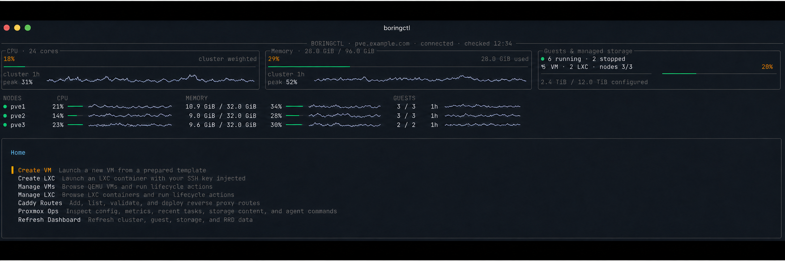

# boringctl

`boringctl` is a Proxmox CLI and terminal UI for provisioning and operating
QEMU virtual machines and LXC containers. Proxmox stays the source of truth;
there is no separate control-plane database or resident agent.

[Releases](https://github.com/boring-labs/boringctl/releases) ·
[CI](https://github.com/boring-labs/boringctl/actions/workflows/ci.yml) ·
[Security](SECURITY.md) · [MIT license](LICENSE)



_Dashboard shown with synthetic sample data._

## What it does

- Creates VMs and LXC containers from a configurable template catalog
- Shows cluster, node, storage, and guest resource usage in a searchable TUI
- Uses Proxmox RRD data for CPU, memory, disk, and network history
- Handles guest lifecycle actions, tags, snapshots, backups, and restore
- Opens type-aware shell access to nodes, containers, and VMs
- Exposes stable JSON output and command schemas for scripts and agents
- Runs read-only configuration and integration checks with `boringctl doctor`
- Optionally manages and deploys Caddy routes from a Git repository

## Install

Download the archive for your platform and `checksums.txt` from the
[latest release](https://github.com/boring-labs/boringctl/releases/latest).
Verify the archive's SHA-256 digest before installing the binary on your
`PATH`. Releases are available for Linux and macOS on amd64 and arm64.

With Go 1.25 or newer:

```bash
go install github.com/boring-labs/boringctl/cmd/boringctl@latest
boringctl version
```

From a source checkout:

```bash
go build -o boringctl ./cmd/boringctl
./boringctl version
```

## Quick start

For the complete first-time setup, including Proxmox user and token creation,
catalog configuration, templates, SSH, and troubleshooting, follow the
[getting started guide](docs/getting-started.md).

Create the config directory. From an extracted release archive or source
checkout, copy the version-matched example:

```bash
mkdir -p ~/.config/boringctl
cp configs/boringctl.example.yaml ~/.config/boringctl/config.yaml
$EDITOR ~/.config/boringctl/config.yaml
```

When installed with `go install`, download the example from the repository:

```bash
mkdir -p ~/.config/boringctl
curl -fsSL \
  https://raw.githubusercontent.com/boring-labs/boringctl/main/configs/boringctl.example.yaml \
  -o ~/.config/boringctl/config.yaml
$EDITOR ~/.config/boringctl/config.yaml
```

Supply a dedicated Proxmox API token through the environment:

```bash
export PVE_TOKEN_ID='boringctl@pve!cli'
export PVE_TOKEN_SECRET='your-token-secret'
```

Or keep those values in an owner-only credentials file:

```bash
install -m 600 /dev/null ~/.config/boringctl/credentials.env
$EDITOR ~/.config/boringctl/credentials.env
```

Enter the values in the editor so the token secret does not enter shell
history:

```dotenv
PVE_TOKEN_ID=boringctl@pve!cli
PVE_TOKEN_SECRET=your-token-secret
```

Check the configuration and live integrations before making changes:

```bash
boringctl doctor
boringctl tui
```

See [configuration](docs/configuration.md) for TLS, permissions, profiles,
catalog discovery, and SSH requirements.

## Common commands

Preview and create a VM:

```bash
boringctl create \
  --node pve1 \
  --image ubuntu-24.04 \
  --plan small \
  --name api-01 \
  --storage local-lvm \
  --ssh-key default \
  --network dhcp \
  --dry-run

boringctl create \
  --node pve1 \
  --image ubuntu-24.04 \
  --plan small \
  --name api-01 \
  --storage local-lvm \
  --ssh-key default \
  --network dhcp
```

Inspect guests by name or VMID, then use the numeric VMID for mutations:

```bash
boringctl list --node pve1 --status running
boringctl show api-01
boringctl start 120
boringctl snapshot 120 before-upgrade
boringctl backup create 120 --storage backup
```

Open a shell anywhere in the cluster:

```bash
boringctl shell node:pve1 -- pveversion
boringctl shell lxc:tools-01 -- uname -a
boringctl shell vm:api-01 --user ubuntu -- uptime
```

The [operations guide](docs/operations.md) covers provisioning, lifecycle
actions, shell access, the TUI, task inspection, storage, and template builds.

## Terminal UI

Running `boringctl` without a subcommand opens the TUI when the process has an
interactive terminal:

```bash
boringctl
```

The home screen summarizes weighted cluster CPU and memory, usage across
configured storage, guest counts, per-node health, and recent Proxmox RRD
history. Guest and node details use compact braille charts for CPU, memory,
disk, and network activity. Press `/` to search and `r` to refresh.

The minimum supported terminal size is 80 × 24. Smaller terminals show a resize
message instead of a cramped interface.

## Optional Caddy integration

`boringctl` can generate, validate, deploy, and roll back Caddy routes stored in
a Git repository. It is disabled unless the `caddy` config block is present.

```bash
boringctl caddy check
boringctl caddy add-site \
  --domain app.example.com \
  --target 192.0.2.50:3000 \
  --visibility internal \
  --type generic \
  --dry-run
boringctl caddy deploy
```

See [Caddy integration](docs/caddy.md) for access controls, deployment recovery,
and the available route templates.

## Automation

Use `--output json` for machine-readable responses and `schema` to discover
commands, flags, and safety metadata:

```bash
boringctl --output json list
boringctl --output json schema shell
boringctl task wait 'UPID:pve1:...' --timeout 5m
```

See [automation](docs/automation.md) for JSON behavior, Proxmox tasks, raw API
access, export/apply, and automatic releases.

## [Documentation](docs/README.md)

- [Getting started](docs/getting-started.md)
- [Configuration](docs/configuration.md)
- [Cluster operations](docs/operations.md)
- [Caddy integration](docs/caddy.md)
- [Automation](docs/automation.md)

## Development

The module requires Go 1.25 or newer.

```bash
gofmt -w $(rg --files -g '*.go')
go test ./...
go vet ./...
go build ./...
```

Read [CONTRIBUTING.md](CONTRIBUTING.md) before opening a pull request. Security
issues should follow [SECURITY.md](SECURITY.md), not the public issue tracker.

`boringctl` is available under the [MIT License](LICENSE).
